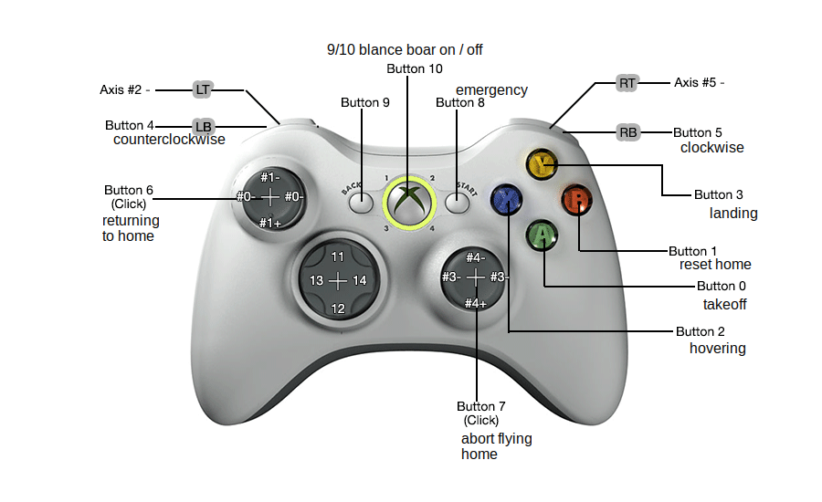

# AIS-Drone
Game of Drones - HS KL Seminar


## Installation ##
1. Klone das git-Repo ``` git clone https://github.com/fog1992/AIS-Drone.git ``` 
   oder lade die Zip-Datei
2. Den Ordner 'AIS-Drone' öffnen ``` cd AIS-Drone ```
3. Installation der benötigten Pakete: ``` npm install ```

Node-Version: 4.4.4

## Starten der Anwendung ##
Die Anwendung kann mit ```npm start``` oder durch Aufrufen von ```node main.js [OPTION]``` gestartet werden.
Per Default wird der die Tastatur zum Steuern benutzt und auf der Console werden dem Benutzer die wichtigsten Informationen angezeigt. Mit den Tasten '1' und '2' können weitere Geräte zum Steuern aktiviert werden. Das Hilfemenü wird mit der Option --help oder -? angezeigt:


## Tastenbelegung ##
### Keyboard ###

### Xbox ###


## Code Infos ##
Die Node Anwendung ist Komponentenweise aufgebaut. Um eine Komponente in einer anderen zu benutzen einfach require(./name) (ohne .js) verwenden, dann steht alles im Module-Exports-Block zur Verfügung.

### Beispiel:

keyboard.js:

```javascript
require('./drone');
var d = Drone.getAndActivateDrone();
```

drone.js:

```javascript
module.exports = {
  getAndActivateDrone: function () {
    if(!started){
      d.start();
      started = true;
    }
    return d;
  }
};
```

###License###


    This program is free software: you can redistribute it and/or modify
    it under the terms of the GNU General Public License as published by
    the Free Software Foundation, either version 3 of the License, or
    (at your option) any later version.

    This program is distributed in the hope that it will be useful,
    but WITHOUT ANY WARRANTY; without even the implied warranty of
    MERCHANTABILITY or FITNESS FOR A PARTICULAR PURPOSE.  See the
    GNU General Public License for more details.

    You should have received a copy of the GNU General Public License
    along with this program.  If not, see <http://www.gnu.org/licenses/>.

THIS SOFTWARE IS PROVIDED "AS IS" AND ANY EXPRESSED OR IMPLIED WARRANTIES, INCLUDING, BUT NOT LIMITED TO, THE IMPLIED WARRANTIES OF MERCHANTABILITY AND FITNESS FOR A PARTICULAR PURPOSE ARE DISCLAIMED. IN NO EVENT SHALL THE REGENTS OR CONTRIBUTORS BE LIABLE FOR ANY DIRECT, INDIRECT, INCIDENTAL, SPECIAL, EXEMPLARY, OR CONSEQUENTIAL DAMAGES (INCLUDING, BUT NOT LIMITED TO, PROCUREMENT OF SUBSTITUTE GOODS OR SERVICES; LOSS OF USE, DATA, OR PROFITS; OR BUSINESS INTERRUPTION)
HOWEVER CAUSED AND ON ANY THEORY OF LIABILITY, WHETHER IN CONTRACT, STRICT LIABILITY, OR TORT (INCLUDING NEGLIGENCE OR OTHERWISE) ARISING IN ANY WAY OUT OF THE USE OF THIS SOFTWARE, EVEN IF ADVISED OF THE POSSIBILITY OF SUCH DAMAGE.
